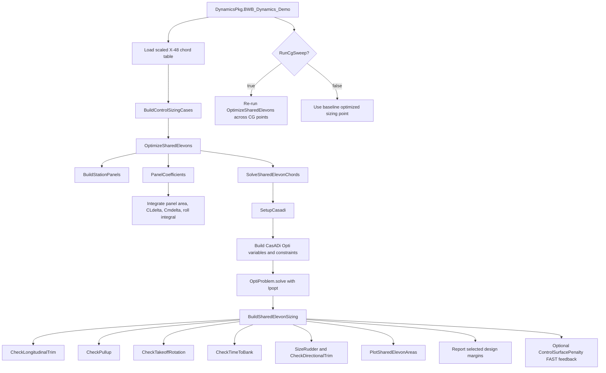

# DynamicsPkg BWB Workflow

The BWB demo sizes shared elevon panels from the scaled X-48 planform. The
CasADi optimization chooses panel chord fractions; the `Check*` functions then
evaluate the selected geometry numerically for reporting and plots.



Run from the repository root:

```matlab
DynamicsPkg.BWB_Dynamics_Demo(true, true, false)
```
